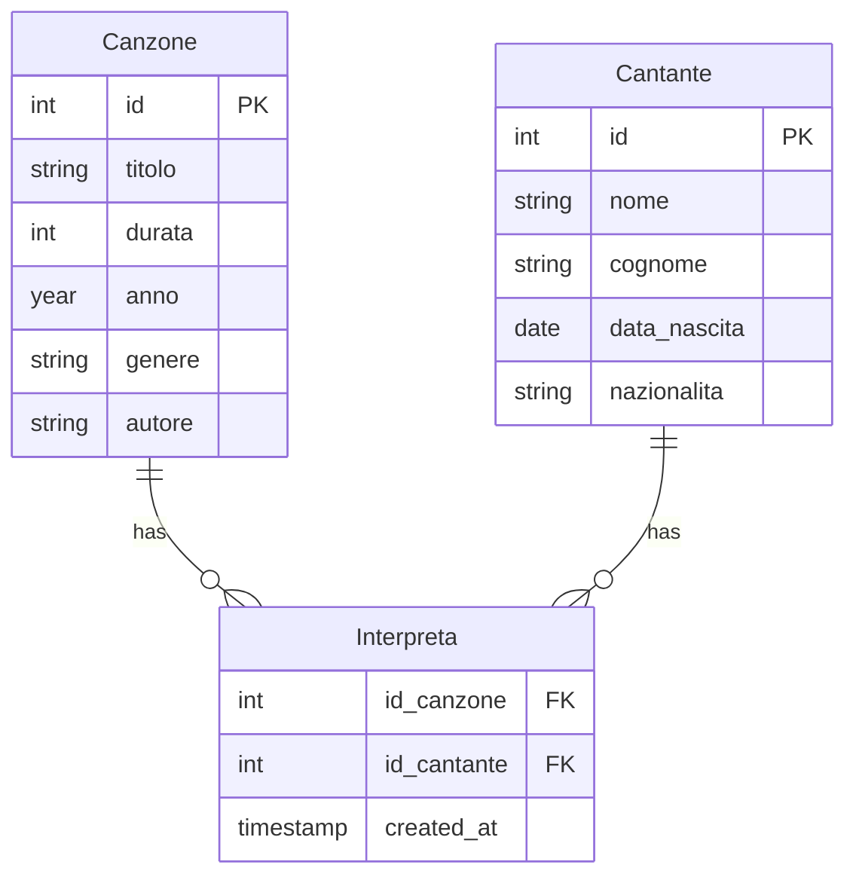

## TODO
Da fare, REST api per gestire l'inserimento, sarebbe elegante.
### (idea) Modello ER
Avremo un cantante che interpreta una canzone, una canzone può essere interpretata da più cantanti.
Canzone (id, titolo, durata, anno, genere, cantante)
Cantante (id, nome, cognome, data_nascita, nazionalità)

### Progettazione DB
```sql
CREATE DATABASE JukeBox;
USE JukeBox;

CREATE TABLE Cantante (
    id INT PRIMARY KEY AUTO_INCREMENT,
    nome VARCHAR(255) NOT NULL,
    cognome VARCHAR(255) NOT NULL,
    data_nascita DATE NOT NULL,
    nazionalità VARCHAR(255) NOT NULL
);

CREATE TABLE Canzone (
    id INT PRIMARY KEY AUTO_INCREMENT,
    titolo VARCHAR(255) NOT NULL,
    durata INT NOT NULL,
    anno YEAR NOT NULL,
    genere VARCHAR(255) NOT NULL,
    autore VARCHAR(255) NOT NULL
);

CREATE TABLE Interpreta ( -- Changed the table name to 'Interpreta' for clarity
    id_canzone INT,
    id_cantante INT,
    created_at TIMESTAMP DEFAULT CURRENT_TIMESTAMP,
    PRIMARY KEY (id_canzone, id_cantante),
    FOREIGN KEY (id_canzone) REFERENCES Canzone(id),
    FOREIGN KEY (id_cantante) REFERENCES Cantante(id)
);
```

**Changes:**

*   **Table name:** Changed the table name `fk_interpreta` to `Interpreta`, which is more descriptive.

**ER Model**



**Changes:**

*   **`Interpreta` Entity:** We've introduced an `Interpreta` entity as a relationship, not just an association between the two tables.
*   **Relationships:** The relationship is now clear, a song can have multiple singers and a singer can have multiple songs.
*   **`interprets` and `performs`:** I added the verbs between each relationship, for readability.

**Explanation**

*   **`Interpreta` (Interprets):** The `Interpreta` table acts as the link between `Canzone` and `Cantante`. It contains foreign keys to both tables (`id_canzone`, `id_cantante`), representing which artist performs which song.
*   **No Direct Relation:** There is no direct relation between the two tables, meaning no direct foreign keys inside the tables.

**Why This is Correct**

This setup correctly models the many-to-many relationship:

*   Each row in the `Interpreta` table links a specific song to a specific artist.
*   A song can appear in multiple rows of `Interpreta` (with different artists).
*   An artist can appear in multiple rows of `Interpreta` (with different songs).

**Updated Markdown (with corrected sections):**

```markdown
## JukeBox PHP/MySQL Project

### Goal
Build a RESTful API for a JukeBox application that allows users to manage songs and artists.

### (idea) Modello ER
Avremo un cantante che interpreta una canzone, una canzone può essere interpretata da più cantanti.
Canzone (id, titolo, durata, anno, genere, autore)
Cantante (id, nome, cognome, data_nascita, nazionalità)


### REST API Endpoints

*   **Songs:**
    *   `GET /songs`: Get all songs
    *   `GET /songs/{id}`: Get a specific song
    *   `POST /songs`: Create a new song
    *   `PUT /songs/{id}`: Update a song
    *   `DELETE /songs/{id}`: Delete a song
*   **Artists:**
    *   `GET /artists`: Get all artists
    *   `GET /artists/{id}`: Get a specific artist
    *   `POST /artists`: Create a new artist
    *   `PUT /artists/{id}`: Update an artist
    *   `DELETE /artists/{id}`: Delete an artist

### Features
- [x] Inserimenti (POST)
    - [x] Canzoni
    - [x] Cantanti
- [x] Letture (GET)
    - [x] Canzoni
    - [x] Cantanti
- [x] Eliminazioni (DELETE)
    - [x] Canzoni
    - [x] Cantanti
- [x] Modifiche (PUT)
    - [x] Canzoni
    - [x] Cantanti
### Bugs
- [ ] Input validation on all endpoints
- [ ] Handling of unexpected errors gracefully (500 status code)
- [ ] Implement logging
### Documentation
- [x] Document all endpoints, request/response examples, parameters
- [x] Database Schema documentation
- [x] API documentation with Swagger or similar.
- [x] File structure documentation
- [x] Analysis of the project

## Interfacce e Metodi

### Database Connection
- **File:** `conn/config.php`
- **Metodi:**
  - `createConnection()`: Stabilisce la connessione al database
  - `closeConnection()`: Chiude la connessione al database

### Songs Controller (`SongsController.php`)
- **Metodi:**
  - `createSong(array $data)`: Crea una nuova canzone
  - `getAllSongs()`: Recupera tutte le canzoni
  - `getSongById(int $id)`: Recupera una canzone specifica
  - `updateSong(int $id, array $data)`: Aggiorna una canzone
  - `deleteSong(int $id)`: Elimina una canzone

### Artists Controller (`ArtistsController.php`)
- **Metodi:**
  - `createArtist(array $data)`: Crea un nuovo artista
  - `getAllArtists()`: Recupera tutti gli artisti
  - `getArtistById(int $id)`: Recupera un artista specifico
  - `updateArtist(int $id, array $data)`: Aggiorna un artista
  - `deleteArtist(int $id)`: Elimina un artista

### Interpretazioni Controller (`InterpretiController.php`)
- **Metodi:**
  - `addInterpretazione(int $id_canzone, int $id_cantante)`: Aggiunge un'interpretazione
  - `getInterpretiByCanzone(int $id_canzone)`: Recupera gli artisti di una canzone
  - `getInterpretiByArtista(int $id_artista)`: Recupera le canzoni di un artista
```
